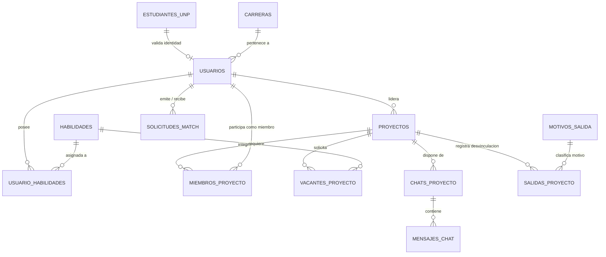

# Faltan espacios que conecten a estudiantes de distintas carreras para armar equipos multidisciplinarios de emprendimiento

**Documento Integral de Diseño, Arquitectura, Desarrollo y Bitácora del Proyecto NexusCampus**  
*Plataforma Universitaria de Co-fundación y Smart Matching Multidisciplinario*

---

## Índice General

1. [Resumen Ejecutivo](#1-resumen-ejecutivo)
2. [Definición Profunda de la Problemática](#2-definición-profunda-de-la-problemática)
   * 2.1. El fenómeno de las islas académicas y los silos de conocimiento
   * 2.2. Consecuencias en el ecosistema emprendedor universitario
   * 2.3. Por qué las iniciativas existentes (grupos de WhatsApp, ferias) fracasan
3. [Propuesta de Valor: NexusCampus (NEXUS)](#3-propuesta-de-valor-nexuscampus-nexus)
   * 3.1. Enfoque metodológico: La tríada Hacker + Hipster + Hustler
   * 3.2. Principio de "Matching Ciego" y validación académica institucional
   * 3.3. Transición fluida a la comunicación real (WhatsApp Bridge)
   * 3.4. Cultura de compromiso y offboarding sin ghosting
4. [Arquitectura Tecnológica del Sistema](#4-arquitectura-tecnológica-del-sistema)
   * 4.1. Stack Tecnológico Elegido y Razón de Cada Herramienta
   * 4.2. Estructura de Carpetas del Proyecto (Frontend y Backend)
   * 4.3. Modelo de Datos Relacional y Esquema SQLite
5. [Módulos Funcionales y Casos de Uso (Detalle Paso a Paso)](#5-módulos-funcionales-y-casos-de-uso-detalle-paso-a-paso)
   * 5.1. CU-00: Verificación de Identidad con Padrón Oficial UNP y Onboarding
   * 5.2. CU-01: Descubrimiento de Talento y Asistente Semántico con IA
   * 5.3. CU-02: Sistema de Solicitudes de Conexión y Notificaciones
   * 5.4. CU-03: Emprende / Publicación y Gestión de Proyectos con Vacantes
   * 5.5. CU-04: Canales de Colaboración (Salas de Chat y Enlace WhatsApp)
   * 5.6. CU-05: Offboarding Estructurado y Encuesta de Retiro Responsable
6. [El Motor de Inteligencia Artificial y Recomendación Multidisciplinaria](#6-el-motor-de-inteligencia-artificial-y-recomendación-multidisciplinaria)
   * 6.1. ¿Cómo comprende la IA las necesidades en lenguaje natural?
   * 6.2. La lógica de dominios complementarios (Tech, Design, Business, Growth, Agro, Legal)
   * 6.3. Fórmula matemática de cálculo de compatibilidad (Score 65% - 98%)
   * 6.4. Generación contextual de razones (`ai_reason`)
7. [Bitácora de Desafíos, Problemas Encontrados y Soluciones](#7-bitácora-de-desafíos-problemas-encontrados-y-soluciones)
   * 7.1. El problema de la "Pantalla Blanca" (White Screen of Death) en React
   * 7.2. El problema de "Las recomendaciones siempre son las mismas personas"
   * 7.3. Errores de encoding y conflictos de merge en Git
   * 7.4. Desconexión de datos entre Onboarding y Perfiles Sugeridos
8. [Detalles Extra y Agregados de Valor Diseñados para la Experiencia Estudiantil](#8-detalles-extra-y-agregados-de-valor-diseñados-para-la-experiencia-estudiantil)
9. [Guía de Instalación y Puesta en Marcha](#9-guía-de-instalación-y-puesta-en-marcha)
10. [Conclusiones y Próximos Pasos](#10-conclusiones-y-próximos-pasos)

---

## 1. Resumen Ejecutivo

Las universidades albergan una enorme densidad de talento técnico, creativo y comercial; sin embargo, casi la totalidad de los proyectos de innovación y tesis multidisciplinarias se frustran en etapas tempranas. La causa principal no es la falta de ideas o presupuesto, sino **la inexistencia de un espacio formal, confiable e inteligente que conecte a estudiantes de diferentes carreras para conformar equipos equilibrados**.

**NexusCampus** es una plataforma web colaborativa desarrollada a la medida de la **Universidad Nacional de Piura (UNP)** que resuelve esta desconexión mediante:
1. **Validación institucional ciega**: Conexión con el padrón estudiantil oficial protegiendo la identidad hasta concretar el interés mutuo.
2. **Motor de Smart Matching Asistido por IA**: Un algoritmo que interpreta descripciones de retos en lenguaje natural, filtra perfiles irrelevantes y sugiere talento verdaderamente complementario combinando perfiles técnicos (*Hackers*), diseñadores (*Hipsters*) y gestores de negocio (*Hustlers*).
3. **Flujo integral de trabajo en equipo**: Publicación de proyectos con vacantes específicas, salas de chat sincronizadas con generación de grupos de WhatsApp, y un proceso de desvinculación formal (*Offboarding*) que erradica el abandono informal de proyectos.

---

## 2. Definición Profunda de la Problemática

> **Problemática Central:** *"Faltan espacios que conecten a estudiantes de distintas carreras para armar equipos multidisciplinarios de emprendimiento."*

### 2.1. El fenómeno de las islas académicas y los silos de conocimiento
En los campus universitarios tradicionales, la infraestructura física y los planes de estudio están organizados en facultades aisladas:
* Los estudiantes de **Ingeniería de Sistemas o Software** pasan su vida académica rodeados exclusivamente de programadores.
* Los estudiantes de **Administración y Economía** conviven únicamente con futuros gestores o financieros.
* Los estudiantes de **Diseño o Comunicación** desarrollan sus proyectos entre diseñadores y comunicadores.
* Las facultades aplicadas como **Agronomía o Derecho** rara vez interactúan con las áreas digitales.

Este aislamiento genera un sesgo de confirmación: cuando a un estudiante se le ocurre una idea de negocio o innovación, busca como compañeros de equipo a sus amigos de aula o de su misma carrera.

### 2.2. Consecuencias en el ecosistema emprendedor universitario
La homogeneidad en los equipos universitarios desencadena patrones de fracaso bien identificados:
1. **El proyecto puramente técnico (Solo ingenieros)**: Construyen código complejo, servidores robustos y algoritmos avanzados, pero carecen de nociones de validación de mercado, costos unitarios, estrategia comercial o narrativa de pitch. Al no saber vender ni calcular la viabilidad, el proyecto nunca sale de un repositorio local.
2. **El proyecto puramente comercial (Solo administradores / economistas)**: Diseñan planes de negocio exhaustivos de 80 páginas, modelos financieros en Excel y presentaciones llamativas, pero no cuentan con nadie capaz de programar una API, crear una aplicación web o implementar un prototipo funcional. Se quedan atrapados en diapositivas.
3. **El proyecto sin experiencia de usuario (Sin diseñadores)**: Puede tener lógica de negocio y código funcional, pero la interfaz es incomprensible, hostil para el usuario y carece de identidad de marca.
4. **Deserción por desalineación (El abandono silencioso o "Ghosting")**: Al armarse equipos basados en amistad o afinidad casual en lugar de compromiso y complementariedad de roles, ante el primer examen parcial o sobrecarga académica los miembros dejan de responder los mensajes sin previo aviso, sepultando el proyecto.

### 2.3. Por qué las iniciativas existentes fracasan
* **Grupos informales de WhatsApp o Telegram**: Son canales caóticos sin estructura. Los mensajes se pierden entre memes, avisos de fotocopias o spam. No permiten filtrar por habilidades reales ni verificar si el contacto es realmente alumno de la universidad.
* **Ferias universitarias anuales**: Eventos puntuales de un día al año. No ofrecen continuidad ni un mecanismo digital para dar seguimiento a los proyectos que se conocen allí.
* **Redes profesionales genéricas (LinkedIn)**: Están orientadas a la búsqueda de empleo corporativo tradicional, no a la conformación temprana de co-fundadores universitarios ni al trabajo por proyectos basados en créditos o afinidad de intereses.

---

## 3. Propuesta de Valor: NexusCampus (NEXUS)

NexusCampus fue diseñado como un sistema operativo de colaboración estudiantil que aborda cada uno de estos vacíos mediante características innovadoras:

```
┌────────────────────────────────────────────────────────────────────────┐
│                              NEXUSCAMPUS                               │
├────────────────────────────────────────────────────────────────────────┤
│  1. Validación Institucional ──► Padrón oficial de la UNP              │
│  2. Identidad Blind Match    ──► Conexión libre de sesgos              │
│  3. Smart Matching IA        ──► Hacker + Hipster + Hustler            │
│  4. Publicación & Vacantes   ──► Búsqueda por roles específicos        │
│  5. Puente a WhatsApp        ──► Transición instantánea a mensajería   │
│  6. Offboarding Estructurado ──► Cero ghosting y aprendizaje continuo  │
└────────────────────────────────────────────────────────────────────────┘
```

### 3.1. Enfoque metodológico: La tríada Hacker + Hipster + Hustler
NexusCampus adopta la fórmula de éxito reconocida en aceleradoras mundiales de startups (Y Combinator, Techstars):
* **El Hacker (Tecnología)**: Estudiantes de Ing. de Software e Informática con habilidades en Frontend React, Backend Python, APIs, Bases de datos o Inteligencia Artificial.
* **El Hipster (Diseño y Experiencia)**: Estudiantes de Diseño Digital y Comunicación con habilidades en UI/UX en Figma, UX Research, Prototipado y Branding.
* **El Hustler (Negocio y Crecimiento)**: Estudiantes de Administración, Economía y Comunicación con habilidades en Finanzas, Costos, Modelado de Negocio, Ventas B2B, Pitch y Storytelling.
* **Especialistas de Dominio**: Estudiantes de Agronomía (sensores, biotecnología) o Derecho (propiedad intelectual, acuerdos entre socios).

### 3.2. Principio de "Matching Ciego" y validación académica institucional
Para evitar que los estudiantes sean juzgados por su edad, ciclo o prejuicios personales antes de conocer su potencial, NexusCampus implementa **Matching Ciego**:
* Las habilidades, proyectos y reputación son visibles de inmediato.
* Los datos de contacto directo (número telefónico, correo personal, apellidos completos) solo se revelan **cuando ambas partes han aceptado formalmente la solicitud de conexión**.
* La pertenencia a la universidad se garantiza contrastando el código estudiantil contra el **Padrón Oficial UNP**, eliminando cuentas falsas o externas.

### 3.3. Transición fluida a la comunicación real (WhatsApp Bridge)
Obligar a los estudiantes universitarios a utilizar exclusivamente un chat interno de una plataforma web genera fricción. NexusCampus incluye un chat interno para la primera toma de contacto formal, pero incorpora un **botón generador de grupo de WhatsApp**. Con un solo clic, se crea el enlace directo con un mensaje preconfigurado para que el equipo pueda continuar su día a día en la herramienta que ya tienen abierta en su teléfono móvil.

### 3.4. Cultura de compromiso y offboarding sin ghosting
Si un estudiante decide retirarse de un proyecto debido a exámenes, incompatibilidad horaria o cambio de intereses, la plataforma no le permite simplemente desaparecer. Proporciona un módulo de **Encuesta de Retiro Responsable** (CU-05), donde formaliza su salida, explica el motivo y permite que el líder del proyecto reabra la vacante de manera ordenada sin generar rencores ni incertidumbre.

---

## 4. Arquitectura Tecnológica del Sistema

El proyecto fue concebido con una arquitectura desacoplada, ligera y mantenible, utilizando herramientas modernas para garantizar rapidez y fluidez visual.

### 4.1. Stack Tecnológico Elegido

| Capa | Tecnología | Justificación de Selección |
| :--- | :--- | :--- |
| **Frontend UI** | **React 18 + Vite** | Carga ultra rápida (<300ms de build), reactividad eficiente y ecosistema de componentes desacoplados. |
| **Tipado Frontend** | **TypeScript** | Previene errores en tiempo de compilación (`null checks`, tipos de propiedades de proyectos y perfiles). |
| **Estilos y Diseño** | **Tailwind CSS + Variables Figma** | Fidelidad pixel-perfect con los mockups de Figma (`#6557dc`, tonos menta, coral, ámbar y tema oscuro). |
| **Backend API** | **Python 3 + Flask** | Microframework ágil, sin sobrecarga innecesaria, ideal para APIs REST y manipulación de datos y NLP. |
| **CORS** | **Flask-CORS** | Comunicación segura entre `localhost:5173` (Vite) y `localhost:5001` (Flask). |
| **Base de Datos** | **SQLite 3 (`nexus.db`)** | Embebida, sin necesidad de configurar servidores de base de datos pesados, con integridad relacional (`PRAGMA foreign_keys = ON`). |
| **Control de Versiones**| **Git + GitHub Desktop** | Gestión de ramas, merges limpios y trazabilidad del trabajo del equipo. |

### 4.2. Estructura de Carpetas del Proyecto

```
nexxuscampus/
├── backend/
│   ├── app.py                      # Punto de entrada de la API Flask y registro de Blueprints
│   ├── database/
│   │   ├── conexion.py             # Conexión SQLite con row_factory = sqlite3.Row
│   │   ├── nexus.db                # Base de datos relacional del proyecto
│   │   ├── schema.sql              # Definición de tablas y claves foráneas
│   │   ├── seed.py                 # Datos semilla iniciales del sistema
│   │   └── seed_talento_unp.py     # Población de 16 perfiles multidisciplinarios UNP
│   └── routes/
│       ├── auth.py                 # CU-00: Validación padrón UNP, perfil y onboarding
│       ├── proyectos.py            # CU-01 & CU-03: CRUD de proyectos, vacantes y talento
│       ├── ai_matching.py          # Motor semántico de IA y Smart Matching
│       ├── chats.py                # CU-04: Salas de chat y generador de enlaces a WhatsApp
│       ├── solicitudes.py          # CU-02: Bandeja de notificaciones y solicitudes de match
│       └── salida.py               # CU-05: Catálogo de motivos y registro de offboarding
├── frontend/
│   ├── src/
│   │   ├── components/
│   │   │   ├── ErrorBoundary.tsx   # Escudo contra pantallas blancas por errores de render
│   │   │   ├── Icon.tsx            # Biblioteca de iconos SVG basados en Figma
│   │   │   ├── Modals.tsx          # Modales interactivos (Invitar, Offboarding, Notificaciones)
│   │   │   ├── TalentCard.tsx      # Tarjeta reutilizable de perfil de talento
│   │   │   └── ui.tsx              # Componentes atómicos robustos (Avatar, Button, Chip, Stars)
│   │   ├── layout/
│   │   │   └── AppShell.tsx        # Barra lateral de navegación, topbar y conmutador de temas
│   │   ├── pages/
│   │   │   ├── Onboarding.tsx      # Paso a paso de confirmación de identidad y habilidades
│   │   │   ├── AiLoadingScreen.tsx # Pantalla visual de procesamiento de Smart Matching
│   │   │   ├── SuggestedProfiles.tsx# Perfiles sugeridos personalizados por IA post-onboarding
│   │   │   ├── Dashboard.tsx       # Inicio con resumen de ideas y accesos rápidos
│   │   │   ├── Explore.tsx         # Buscador con Asistente de IA, por habilidades y carreras
│   │   │   ├── Partners.tsx        # Socios recomendados según complementariedad de carrera
│   │   │   ├── Publish.tsx         # Publicación de proyectos en 3 pasos con vacantes
│   │   │   ├── ProjectDetail.tsx   # Detalle completo de un emprendimiento
│   │   │   ├── Messages.tsx        # Salas de chat activas con WhatsApp bridge
│   │   │   └── Profile.tsx         # Gestión del perfil propio y habilidades seleccionadas
│   │   ├── services/
│   │   │   └── api.js              # Cliente HTTP centralizado para interactuar con la API Flask
│   │   └── types.ts                # Definiciones de tipos TypeScript compartidos
│   ├── package.json
│   └── vite.config.ts
└── DOCUMENTO_PROYECTO_NEXUSCAMPUS.md # Documento de especificación completo
```

### 4.3. Modelo de Datos Relacional (`nexus.db`)

El modelo de datos fue diseñado con **12 tablas relacionales** que garantizan la consistencia:



1. **`estudiantes_unp`**: Registro oficial simulado del padrón universitario (`codigo_estudiante`, `correo_institucional`, `nombres`, `apellidos`, `carrera`).
2. **`usuarios`**: Perfiles activos en la plataforma con campos de situación actual, reputación promedio y aceptación de términos.
3. **`carreras`**: Carreras de la UNP con su descripción funcional.
4. **`habilidades`**: Catálogo de competencias catalogadas como "Dura" (técnica) o "Blanda" (colaborativa).
5. **`usuario_habilidades`**: Tabla puente muchos-a-muchos entre usuarios y habilidades.
6. **`proyectos`**: Emprendimientos publicados con su sector, nivel de madurez y líder.
7. **`vacantes_proyecto`**: Perfiles y habilidades que el proyecto necesita cubrir.
8. **`miembros_proyecto`**: Equipo formal con roles específicos y estados de membresía.
9. **`solicitudes_match`**: Registro de invitaciones mutuas para conectar.
10. **`chats_proyecto` & `mensajes_chat`**: Hilos de mensajería interna con registro de marcas temporales.
11. **`motivos_salida` & `salidas_proyecto`**: Auditoría de desvinculaciones respetuosas y lecciones aprendidas.

---

## 5. Módulos Funcionales y Casos de Uso (Detalle Paso a Paso)

### 5.1. CU-00: Verificación de Identidad con Padrón Oficial UNP y Onboarding
* **Objetivo**: Asegurar que cada miembro pertenezca a la comunidad universitaria y configurar su tarjeta de talento.
* **Paso 1 (Identidad)**: El usuario selecciona su código o ingresa sus credenciales institucionales. El sistema consulta `/api/auth/verificar-unp/<codigo>` y precarga de forma segura su nombre, carrera y ciclo.
* **Paso 2 (Identidad de Talento)**: El estudiante elige de 3 a 5 habilidades técnicas que domina y 2 o 3 habilidades blandas con las que colabora mejor.
* **Paso 3 (Objetivo y Rol)**: Define si ingresa con un proyecto en mente (*"Tengo un proyecto"*) o si desea sumarse a iniciativas existentes (*"Busco equipo"*). Al finalizar, la API ejecuta `/api/auth/onboarding` y activa su perfil completado.

### 5.2. CU-01: Descubrimiento de Talento y Asistente Semántico con IA
* **Ubicación**: Pantalla **Descubrir** (`Explore.tsx`).
* **Modo Asistente con IA**: El estudiante escribe en lenguaje natural lo que necesita. Por ejemplo:
  > *"Necesitamos a alguien que valide nuestros costos, presupuestos y nos ayude a preparar el pitch para jurados."*
* **Procesamiento**: La API `/api/ai/buscar-por-descripcion` descompone la frase, identifica habilidades requeridas (`Finanzas`, `Costos y Presupuestos`, `Modelado Financiero y Pitch`), determina el dominio correspondiente (*Business / Economía*) y entrega una lista ordenada de perfiles pertinentes con sus porcentajes de compatibilidad y una explicación redactada por la IA.
* **Modo Habilidades y Modo Carrera**: Permite explorar mediante chips visuales interactivos (*Finanzas*, *UX Research*, *React*, *Python*, etc.).

### 5.3. CU-02: Sistema de Solicitudes de Conexión y Notificaciones
* **Ubicación**: Modales de conexión y Drawer lateral de Notificaciones.
* **Flujo**:
  1. Al hacer clic en *"Conectar"* en una tarjeta de talento, se abre el modal de invitación donde se puede incluir un mensaje personalizado de bienvenida.
  2. La solicitud se persiste en `solicitudes_match` con estado `Pendiente`.
  3. El destinatario recibe una alerta en su barra superior (`topbar`).
  4. Al pulsar *"Aceptar"*, el estado cambia a `Aceptada` y se desbloquean los canales directos de conversación.

### 5.4. CU-03: Emprende / Publicación y Gestión de Proyectos con Vacantes
* **Ubicación**: Pantalla **Emprende** (`Publish.tsx`).
* **Paso 1**: Nombre de la iniciativa, sector (EdTech, AgTech, HealthTech, etc.) y nivel de madurez (Idea inicial, Prototipo, MVP en validación).
* **Paso 2**: Contexto del reto: Planteamiento del problema, solución propuesta e impacto estimado medible.
* **Paso 3**: Definición de vacantes con selección de habilidades requeridas (ej. *"Se busca especialista en UI/UX y alguien de Estrategia Comercial"*).
* **Resultado**: Se crea el proyecto en la base de datos, se asigna al creador como Líder de Proyecto y se crea automáticamente una sala de chat vinculada.

### 5.5. CU-04: Canales de Colaboración (Salas de Chat y Enlace WhatsApp)
* **Ubicación**: Pantalla **Mensajes** (`Messages.tsx`).
* **Funcionalidad**: Lista las salas activas de los proyectos en los que participa el usuario.
* **WhatsApp Bridge**: En la cabecera del chat, un botón con el icono de WhatsApp ejecuta `/api/chat/<id>/whatsapp`. La API devuelve una URL segura en formato `https://wa.me/?text=...` que abre inmediatamente WhatsApp Web o la aplicación móvil con un mensaje cordial redactado:
  > *"¡Hola equipo de Vitrina Circular! Les escribo desde NexusCampus para coordinar nuestra próxima reunión de avance."*

### 5.6. CU-05: Offboarding Estructurado y Encuesta de Retiro Responsable
* **Ubicación**: Modal de Desvinculación (`Modals.tsx` -> `Offboarding`).
* **Funcionamiento**: Permite al miembro seleccionar el proyecto del que se retira, elegir el motivo principal (Sobrecarga de cursos, Desalineación de intereses, Falta de tiempo o Asuntos personales) y redactar una retroalimentación constructiva. Esto preserva la reputación de ambas partes y permite reabrir la vacante automáticamente.

---

## 6. El Motor de Inteligencia Artificial y Recomendación Multidisciplinaria

Uno de los principales hitos de NexusCampus es su motor de emparejamiento inteligente implementado en [`backend/routes/ai_matching.py`](file:///c:/Users/Karol/OneDrive/Documentos/GitHub/nexxuscampus/backend/routes/ai_matching.py).

### 6.1. ¿Cómo comprende la IA las necesidades en lenguaje natural?
El motor utiliza procesamiento de lenguaje natural (NLP) determinista y normalización fonética:
1. **Normalización NFD**: Remueve tildes, signos ortográficos y normaliza mayúsculas/minúsculas para que `"diseño"`, `"diseno"`, `"DISEÑO"` o `"diseños"` sean equivalentes.
2. **Diccionario Semántico Enriquecido (`SEMANTIC_DICTIONARY`)**: Mapea más de 50 intenciones comunes en el lenguaje estudiantil hacia habilidades formales de la base de datos:
   * Términos como `"web"`, `"pantalla"`, `"frontend"`, `"react"`, `"sitio"`, `"codigo"` $\rightarrow$ `Desarrollo Frontend React`, `Desarrollo Web`, `HTML y CSS Tailwind`.
   * Términos como `"costos"`, `"dinero"`, `"precio"`, `"viabilidad"`, `"inversion"`, `"pitch"` $\rightarrow$ `Costos y Presupuestos`, `Análisis de Viabilidad Económica`, `Modelado Financiero y Pitch`, `Finanzas`.
   * Términos como `"sensores"`, `"campo"`, `"cultivo"`, `"riego"` $\rightarrow$ `Optimización de Procesos Agro`, `Sensores IoT y Telemetría`.

### 6.2. La lógica de dominios complementarios
El sistema clasifica las disciplinas en 6 dominios fundamentales y calcula afinidades cruzadas:

```
┌──────────────────┐           ┌──────────────────┐
│     DOMINIO      │◄─────────►│     DOMINIO      │
│ TECNOLÓGICO      │ Sinergia  │ DISEÑO & UX      │
│ (Software/Info)  │           │ (Diseño Digital) │
└────────┬─────────┘           └─────────┬────────┘
         │                               │
         │         ┌───────────┐         │
         └────────►│  DOMINIO  │◄────────┘
                   │ NEGOCIOS  │
                   │(Admin/Eco)│
                   └───────────┘
```

* Un líder del **dominio tecnológico** recibe como máxima prioridad recomendaciones de estudiantes de **Diseño** (UI/UX) y de **Negocios** (Finanzas y Pitch).
* Un líder del **dominio de negocios** recibe prioritariamente desarrolladores de **Software** y diseñadores.
* Un líder de **Diseño** recibe prioritariamente desarrolladores de **Backend/APIs** y perfiles de **Estrategia Comercial**.

### 6.3. Fórmula matemática de compatibilidad (Score 65% a 98%)

Para evitar que todos los estudiantes reciban el mismo puntaje, el porcentaje de match ($M$) se calcula de manera dinámica:

$$Score = Base + P_{técnicos} + P_{dominio} + P_{blandas} + P_{reputación}$$

Donde:
* **$Base$**: 55 puntos para cualquier perfil que califique con al menos 1 coincidencia técnica o afinidad de carrera.
* **$P_{técnicos}$**:
  * 1 habilidad técnica clave coincidente: $+24$ puntos.
  * 2 habilidades técnicas coincidentes: $+34$ puntos.
  * 3 o más habilidades técnicas coincidentes: $+39$ puntos.
* **$P_{dominio}$**: $+5$ puntos si la carrera del estudiante pertenece al dominio temático del reto.
* **$P_{blandas}$**: $+3$ puntos si posee habilidades colaborativas (comunicación, liderazgo, adaptabilidad).
* **$P_{reputación}$**: $(Rating - 4.5) \times 6.0$ puntos (premia a estudiantes con historial confiable de 4.8 o 4.9).
* **Filtro de exclusión estricta**: Si $P_{técnicos} == 0$ y la carrera no tiene relación con el dominio buscado, **el candidato es descartado inmediatamente de los resultados**.
* **Límites**: El resultado final se calibra en un rango natural de $65\%$ a $98\%$.

### 6.4. Generación contextual de razones (`ai_reason`)
En lugar de mostrar textos fijos, el motor genera una explicación en lenguaje natural para cada perfil:
* Si hubo coincidencia técnica:
  > *"El perfil de Ana Sofía en Ingeniería de Software es ideal porque aporta experiencia directa en Desarrollo Frontend React y React, resolviendo con precisión lo que necesitas para tu siguiente hito."*
* Si es por complementariedad de carrera:
  > *"Equilibra el perfil de Ingeniería Informática sumando diseño centrado en el usuario, prototipado en Figma y usabilidad."*

---

## 7. Bitácora de Desafíos, Problemas Encontrados y Soluciones

Durante el desarrollo e integración del proyecto, se identificaron y resolvieron diversos obstáculos técnicos complejos:

### 7.1. El problema de la "Pantalla Blanca" (White Screen of Death) en React
* **Síntoma reportado**: Al navegar entre pantallas o pulsar en ciertos perfiles, la aplicación dejaba de responder y mostraba una pantalla completamente en blanco.
* **Causa Raíz Diagnosticada**:
  1. En `components/ui.tsx`, la función del componente `Avatar` ejecutaba `label.split(' ')` asumiendo que `label` siempre era un string válido. Si una respuesta del backend traía un nombre nulo o indefinido, la invocación de `split()` lanzaba una excepción fatal no controlada.
  2. En `pages/ProjectDetail.tsx`, el componente intentaba hacer `project.needs.map(...)`. Los proyectos creados en la base de datos SQLite no tenían la propiedad `needs` en inglés sino `vacantes` en español, provocando un fallo de ejecución en JavaScript.
  3. En `pages/Messages.tsx`, se invocaba `.split(' ')` sobre títulos de salas no definidos.
* **Solución Implementada**:
  * Se robusteció el componente `Avatar` con fallback defensivo: `(label || 'NC').split(' ')`.
  * Se normalizaron las propiedades de los proyectos (`project.name || project.nombre`, `project.needs || project.vacantes || []`).
  * Se implementó un componente envolvente **`ErrorBoundary.tsx`** en el nivel superior de `AppShell`. Ahora, si cualquier componente hijo experimenta un error de renderizado, la aplicación no se apaga: muestra una tarjeta estética con botón *"Reintentar"* y permite continuar navegando sin recargar.

### 7.2. El problema de "Las recomendaciones siempre son las mismas personas"
* **Síntoma reportado**: Sin importar si se buscaba *"páginas web"* o *"costos y finanzas"*, la plataforma siempre recomendaba a las mismas 4 personas (Juan Carlos primero, María Elena segunda, etc.), todas con un puntaje idéntico del 85% al 98%.
* **Causas Raíz Diagnosticadas**:
  1. **Base de datos reducida**: La base de datos original solo tenía 4 usuarios creados en el seed inicial. No existían perfiles dedicados de Frontend React, Agronomía moderna o Derecho.
  2. **Saturación matemática del algoritmo**: El código previo calculaba `max(75, 70 + puntos)`. Cualquier habilidad blanda (que casi todos tenían) sumaba 15 puntos, y una palabra clave sumaba 35 puntos. Por tanto: $70 + 35 + 15 = 120 \rightarrow 98\%$. Prácticamente todos los candidatos empataban en el tope de 98%.
  3. **Preservación del orden de inserción de SQLite**: Dado que el ordenamiento de Python con `sort()` es estable, cuando múltiples elementos empatan en puntuación, se preserva su orden original en la tabla (`id=1`, `id=2`, `id=3`). Por eso Juan Carlos (id 1) aparecía invariablemente en el primer lugar.
  4. **Ausencia de filtrado negativo**: Quienes tenían cero relación con la búsqueda obtenían un 85% por defecto y no eran excluidos.
* **Soluciones Implementadas**:
  * Se creó y ejecutó el script [`seed_talento_unp.py`](file:///c:/Users/Karol/OneDrive/Documentos/GitHub/nexxuscampus/backend/database/seed_talento_unp.py), incorporando **16 estudiantes reales de diversas facultades** de la UNP con habilidades especializadas.
  * Se reescribió por completo la función de búsqueda (`buscar_por_descripcion`) y de compatibilidad (`smart_match_complementario`):
    * Se eliminó el piso artificial de 70 puntos.
    * Se impuso la regla de exclusión estricta para candidatos con cero coincidencia técnica.
    * Se calibro la puntuación para que una persona con habilidades directas obtenga 96%-98%, personas con habilidades secundarias 80%-86%, y perfiles no pertinentes queden fuera.
  * Al probar las búsquedas, cada consulta retorna grupos totalmente diferenciados (ej. programadores para *"páginas web"*, economistas para *"costos"*, ingenieros agrónomos para *"sensores"*).

### 7.3. Errores de encoding y conflictos de merge en Git
* **Síntoma**: En Windows PowerShell, los scripts de seeding en Python fallaban con `UnicodeEncodeError: 'charmap' codec can't encode character '\u2713'`.
* **Solución**: Se reemplazaron los caracteres especiales no estándar por cadenas ASCII universales (`[OK]`), garantizando compatibilidad multiplataforma. Asimismo, se resolvieron conflictos de Git en `app.py` unificando las rutas de proyectos y autenticación.

### 7.4. Desconexión de datos entre Onboarding y Perfiles Sugeridos
* **Síntoma**: Tras terminar el Onboarding seleccionando la carrera de Ingeniería Informática, la pantalla de "Perfiles sugeridos" seguía mostrando los mismos datos estáticos de prueba.
* **Solución**: Se actualizó `App.tsx` para enviar el objeto `student` autenticado hacia `SuggestedProfiles.tsx`. Este componente ahora invoca directamente a `smartMatchComplementario(student.carrera, student.skills)`, mostrando inmediatamente perfiles de Diseño, Negocios y Comunicación que complementan la carrera del alumno que acaba de registrarse.

---

## 8. Detalles Extra y Agregados de Valor Diseñados para la Experiencia Estudiantil

1. **Tokens de Diseño Figma Oficiales**:
   * Color de marca violeta `#6557dc` (creatividad e identidad institucional).
   * Tonos de acento: Menta (tecnología/datos), Coral (diseño/creatividad), Ámbar (negocios/comunicación), Lima (sustentabilidad/agro).
   * Tipografía Inter con jerarquías claras de peso y tamaño.
2. **Conmutador de Modo Oscuro / Claro**: Integrado en la barra superior para comodidad de los estudiantes durante sesiones de trabajo nocturnas.
3. **Indicador de Horarios de Disponibilidad**: Cada tarjeta de talento detalla los bloques horarios libres del estudiante (ej. *"Mar y jue · Tardes"*, *"Lun, mié y vie · Noches"*), mitigando uno de los principales motivos de deserción en proyectos universitarios.
4. **Protección de Identidad Institucional**: Se previene el acoso o la saturación de mensajes manteniendo en modo ciego el teléfono y los apellidos hasta que ambas partes validan la conexión.
5. **Generador Dinámico de Enlaces a WhatsApp**: Permite trasladar el proyecto a la mensajería diaria sin requerir que los miembros intercambien manualmente números ni creen grupos desde cero.
6. **Módulo de Salud del Equipo (Offboarding)**: Mecanismo formal que profesionaliza el ecosistema estudiantil enseñando prácticas reales de gestión de proyectos y responsabilidad colaborativa.

---

## 9. Guía de Instalación y Puesta en Marcha

Para ejecutar el proyecto en un entorno local de desarrollo:

### Prerrequisitos
* Node.js v18+ y npm instalados.
* Python 3.10+ instalado.
* Git.

### 1. Clonar el Repositorio
```bash
git clone https://github.com/roxo24/nexxuscampus.git
cd nexxuscampus
```

### 2. Configurar y Ejecutar el Backend (Flask)
```bash
cd backend
python -m venv .venv

# En Windows:
.venv\Scripts\activate
# En Linux/Mac:
source .venv/bin/activate

pip install Flask Flask-CORS python-dotenv

# Poblar la base de datos con los 16 talentos de la UNP:
python database/seed_talento_unp.py

# Iniciar el servidor API en el puerto 5001:
python app.py
```
*El backend quedará escuchando en `http://localhost:5001`.*

### 3. Configurar y Ejecutar el Frontend (React + Vite)
En una segunda terminal:
```bash
cd frontend
npm install
npm run dev
```
*El frontend se abrirá en `http://localhost:5173` y se conectará automáticamente a la API de Flask.*

---

## 10. Conclusiones y Próximos Pasos

### Conclusiones
NexusCampus demuestra cómo la tecnología web moderna y la inteligencia artificial semántica pueden solucionar un problema estructural en las universidades: **romper las barreras entre facultades y potenciar el talento joven**.

Al transformar la búsqueda casual de compañeros en un proceso de **Smart Matching guiado por habilidades, complementariedad de roles y compromiso formal**, la plataforma eleva sustancialmente la tasa de supervivencia de los emprendimientos y proyectos de innovación estudiantiles.

### Roadmap Futuro (Siguientes Fases)
1. **Integración con la API de Google Gemini en la nube**: Conectar la clave `GEMINI_API_KEY` para enriquecer aún más las explicaciones cualitativas y sugerir hitos de trabajo semanales a los equipos recién conformados.
2. **Evaluación 360° entre Pares al Finalizar Proyectos**: Permitir que los miembros califiquen el compromiso y las habilidades blandas de sus compañeros al concluir un ciclo académico para alimentar la reputación en la plataforma.
3. **Insignias y Credenciales Digitales Validadas**: Emisión de insignias verificables (Open Badges) respaldadas por las facultades para convalidar horas de prácticas o créditos extracurriculares.
4. **Módulo de Mentorías Docentes**: Espacio donde profesores e investigadores puedan asesorar proyectos multidisciplinarios en áreas técnicas, legales o de mercado.

---
*Documento preparado como memoria técnica y funcional del proyecto NexusCampus (Universidad Nacional de Piura).*
